# con/duct Examples Gallery

> 🤖 Automatically generated gallery of con/duct usage examples
> Last updated: 2026-09-15 15:58 UTC

## 📖 Reading the plots

Every example is plotted once per CPU mode, side by side. The columns are:

- **ps pcpu (raw)**: The `%CPU` column of `ps`, as sampled. It is the process's CPU time divided by its lifetime so far, so it smooths over bursts and lags behind changes. Expect a spike at the very start, when the lifetime is near zero.
- **ps cpu (time-point estimate)**: CPU use over the last report interval, recovered from consecutive `ps` samples (the change in `%CPU` × elapsed time, divided by the interval). It shows bursts the raw view hides and has no startup spike. Because `ps` reports `%CPU` to 0.1%, the recovered value carries an error that grows with the process's age; on runs of many hours the line widens into a noisy band, and the raw view is the better read.

## 📚 Browse by Tag

#### asmacdo

[asmacdo-gallery example-1](#asmacdo-gallery-example-1), [asmacdo-gallery example-2](#asmacdo-gallery-example-2)

#### fmriprep

[fMRIPrep on 1 subject of ds000030](#fmriprep-on-1-subject-of-ds000030), [fMRIPrep on 1 subject of ds002785](#fmriprep-on-1-subject-of-ds002785)

#### juelich

[mriqc processing on a single subject/session](#mriqc-processing-on-a-single-subject-session)

#### local

['s5cmd sync' dry invocation on a mighty dandiarchive bucket](#s5cmd-sync-dry-invocation-on-a-mighty-dandiarchive-bucket), [fMRIPrep on 1 subject of ds000030](#fmriprep-on-1-subject-of-ds000030), [fMRIPrep on 1 subject of ds002785](#fmriprep-on-1-subject-of-ds002785)

#### mechababs

[fMRIPrep on 1 subject of ds000030](#fmriprep-on-1-subject-of-ds000030), [fMRIPrep on 1 subject of ds002785](#fmriprep-on-1-subject-of-ds002785)

#### medium-length

[con/duct Demo Example](#con-duct-demo-example)

#### mriqc

[mriqc processing on a single subject/session](#mriqc-processing-on-a-single-subject-session)

#### openneuro

[fMRIPrep on 1 subject of ds000030](#fmriprep-on-1-subject-of-ds000030), [fMRIPrep on 1 subject of ds002785](#fmriprep-on-1-subject-of-ds002785)

#### s5cmd

['s5cmd sync' dry invocation on a mighty dandiarchive bucket](#s5cmd-sync-dry-invocation-on-a-mighty-dandiarchive-bucket)

#### synthetic

[con/duct Demo Example](#con-duct-demo-example), [asmacdo-gallery example-1](#asmacdo-gallery-example-1), [asmacdo-gallery example-2](#asmacdo-gallery-example-2)

## 📊 Examples

### con/duct Demo Example

**Tags**: [`synthetic`](#synthetic) [`medium-length`](#medium-length)
**Repository**: [github.com/con/duct](https://github.com/con/duct/)

Demo example from the con/duct repository showing resource usage tracking

<table>
<tr><th align="center">ps pcpu (raw)</th><th align="center">ps cpu (time-point estimate)</th></tr>
<tr><td>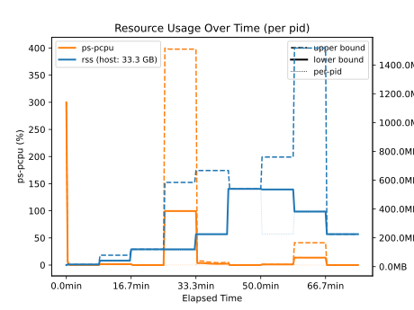</td><td>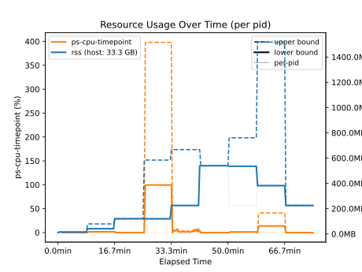</td></tr>
</table>

📋 Metadata

- **Info file**: [example_output_info.json](logs/conduct-demo-example/example_output_info.json)
- **Usage data**: [example_output_usage.json](logs/conduct-demo-example/example_output_usage.json)
- **Standard output**: [stdout](logs/conduct-demo-example/example_output_stdout)
- **Standard error**: [stderr](logs/conduct-demo-example/example_output_stderr)

---

### asmacdo-gallery example-1

**Tags**: [`synthetic`](#synthetic) [`asmacdo`](#asmacdo)
**Repository**: [github.com/asmacdo/asmacdo-duct-gallery](https://github.com/asmacdo/asmacdo-duct-gallery/)

<table>
<tr><th align="center">ps pcpu (raw)</th><th align="center">ps cpu (time-point estimate)</th></tr>
<tr><td>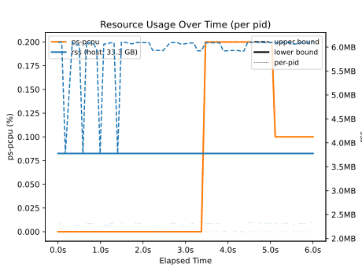</td><td>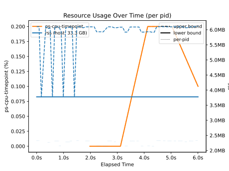</td></tr>
</table>

📋 Metadata

- **Info file**: [example_output_info.json](logs/asmacdo-gallery-example-1/example_output_info.json)
- **Usage data**: [example_output_usage.json](logs/asmacdo-gallery-example-1/example_output_usage.json)
- **Standard output**: [stdout](logs/asmacdo-gallery-example-1/example_output_stdout)
- **Standard error**: [stderr](logs/asmacdo-gallery-example-1/example_output_stderr)

---

### asmacdo-gallery example-2

**Tags**: [`synthetic`](#synthetic) [`asmacdo`](#asmacdo)
**Repository**: [github.com/asmacdo/asmacdo-duct-gallery](https://github.com/asmacdo/asmacdo-duct-gallery/)

<table>
<tr><th align="center">ps pcpu (raw)</th><th align="center">ps cpu (time-point estimate)</th></tr>
<tr><td>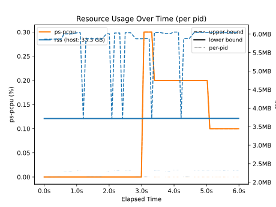</td><td>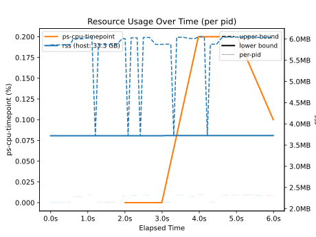</td></tr>
</table>

📋 Metadata

- **Info file**: [example_output_info.json](logs/asmacdo-gallery-example-2/example_output_info.json)
- **Usage data**: [example_output_usage.json](logs/asmacdo-gallery-example-2/example_output_usage.json)
- **Standard output**: [stdout](logs/asmacdo-gallery-example-2/example_output_stdout)
- **Standard error**: [stderr](logs/asmacdo-gallery-example-2/example_output_stderr)

---

### 's5cmd sync' dry invocation on a mighty dandiarchive bucket

**Tags**: [`local`](#local) [`s5cmd`](#s5cmd)

A single process running steadily for seven hours. The raw view is the honest one here: the time-point estimate widens into a band as the process ages (see "Reading the plots"), so the sawtooth is measurement noise, not the workload.

<table>
<tr><th align="center">ps pcpu (raw)</th><th align="center">ps cpu (time-point estimate)</th></tr>
<tr><td>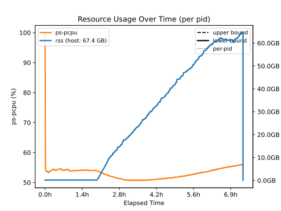</td><td>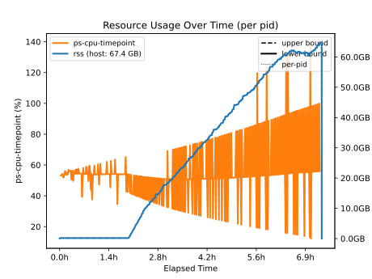</td></tr>
</table>

📋 Metadata

- **Info file**: [example_output_info.json](logs/s5cmd-1/2024.10.28T11.08.51-2733714_info.json)
- **Usage data**: [example_output_usage.json](logs/s5cmd-1/2024.10.28T11.08.51-2733714_usage.json)
- **Standard output**: [stdout](logs/s5cmd-1/2024.10.28T11.08.51-2733714_stdout)
- **Standard error**: [stderr](logs/s5cmd-1/2024.10.28T11.08.51-2733714_stderr)

---

### mriqc processing on a single subject/session

**Tags**: [`mriqc`](#mriqc) [`juelich`](#juelich)
**Repository**: [cerebra.fz-juelich.de/f.hoffstaedter/ds005256-mriqc](https://cerebra.fz-juelich.de/f.hoffstaedter/ds005256-mriqc)

A seventeen-hour run with a handful of processes. The raw view opens with a spike (220% in the first minute) that drifts down over the first few hours before settling near 100%: that is the lifetime average catching up with the steady state, not the workload winding down (see "Reading the plots"). The time-point view has no such spike; it follows the workload from the start.

<table>
<tr><th align="center">ps pcpu (raw)</th><th align="center">ps cpu (time-point estimate)</th></tr>
<tr><td>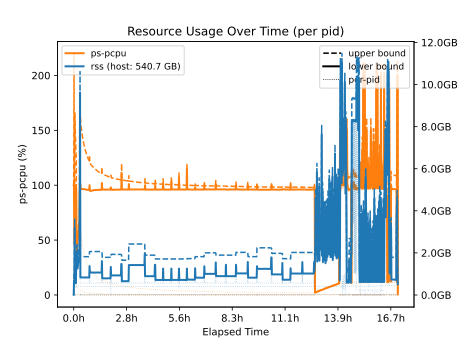</td><td>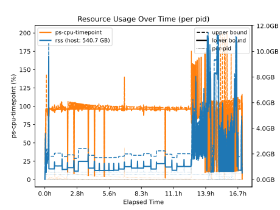</td></tr>
</table>

📋 Metadata

- **Info file**: [example_output_info.json](logs/mriqc-processing-on-a-single-subjectsession/example_output_info.json)
- **Usage data**: [example_output_usage.json](logs/mriqc-processing-on-a-single-subjectsession/example_output_usage.json)
- **Standard output**: [stdout](logs/mriqc-processing-on-a-single-subjectsession/example_output_stdout)
- **Standard error**: [stderr](logs/mriqc-processing-on-a-single-subjectsession/example_output_stderr)

---

### fMRIPrep on 1 subject of ds000030

**Tags**: [`local`](#local) [`fmriprep`](#fmriprep) [`openneuro`](#openneuro) [`mechababs`](#mechababs)

fMRIPrep `--level minimal` on one subject of the UCLA CNP LA5c study (OpenNeuro ds000030): 5.2 hours, 16.9 GB peak. A reading key first, because duct wraps a whole tree of processes and each sample is a snapshot of all of them. The dotted lines are single processes. The solid line is the largest single process at each sample, a lower bound on what the tree needed together. The dashed line is the sum across processes, an upper bound: for memory it counts pages shared between processes once per process. The summary numbers in `info.json`, like the 16.9 GB peak here, are the maximum of that dashed line. In this run the nipype log in stdout puts FreeSurfer's recon-all in the first three hours, where the CPU holds near 200%; after it finishes the profile gets busier and memory climbs in steps to the peak. The two CPU views agree here. SLURM's accounting reported 22.3 GB MaxRSS for the same job. On this cluster that number is the job cgroup's memory counter, which includes file cache the kernel would reclaim when memory runs short, so it sits above even duct's upper bound.

<table>
<tr><th align="center">ps pcpu (raw)</th><th align="center">ps cpu (time-point estimate)</th></tr>
<tr><td>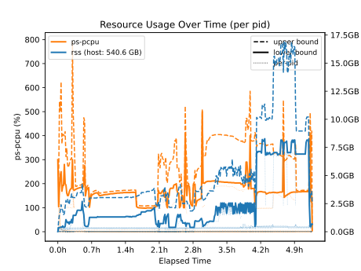</td><td>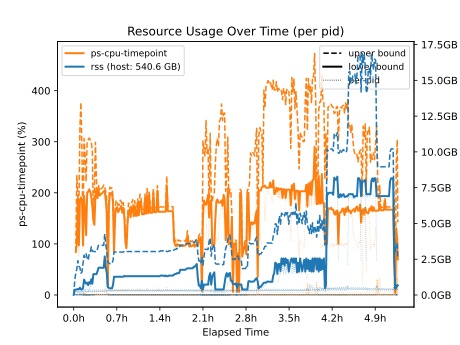</td></tr>
</table>

📋 Metadata

- **Info file**: [example_output_info.json](logs/fmriprep-ds000030-c5/acq-2026.09.09T00.59.50+64123263_1_info.json)
- **Usage data**: [example_output_usage.json](logs/fmriprep-ds000030-c5/acq-2026.09.09T00.59.50+64123263_1_usage.jsonl)
- **Standard output**: [stdout](logs/fmriprep-ds000030-c5/acq-2026.09.09T00.59.50+64123263_1_stdout)
- **Standard error**: [stderr](logs/fmriprep-ds000030-c5/acq-2026.09.09T00.59.50+64123263_1_stderr)

---

### fMRIPrep on 1 subject of ds002785

**Tags**: [`local`](#local) [`fmriprep`](#fmriprep) [`openneuro`](#openneuro) [`mechababs`](#mechababs)

The same configuration on one subject of AOMIC-PIOP1 (OpenNeuro ds002785): 8.15 hours, 25.7 GB peak (SLURM reported 34 GB; same caveat as above). recon-all again finishes about three hours in, and the rest is long plateaus. The two memory bounds separate most from 4.2 to 6.9 hours, where the largest single process holds 10 GB while the sum across processes sits near 20 GB; the run's peak at 5.5 hours is one 12 GB process on top of the rest. The CPU spike is the very last sample, at 8.15 hours: the raw view sums 3600% across 27 processes, which stretches the axis and flattens everything else. Those are short-lived processes in the run's final seconds, each with a near-zero lifetime, whose inflated `%CPU` values add up (the largest single one reads 900%). The time-point estimate needs two samples of a process, so those pids drop out and the 400% plateau underneath stays readable.

<table>
<tr><th align="center">ps pcpu (raw)</th><th align="center">ps cpu (time-point estimate)</th></tr>
<tr><td>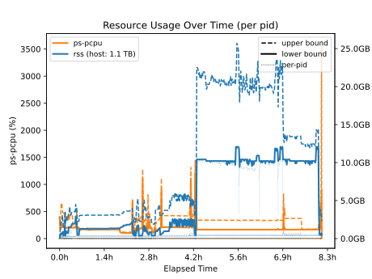</td><td>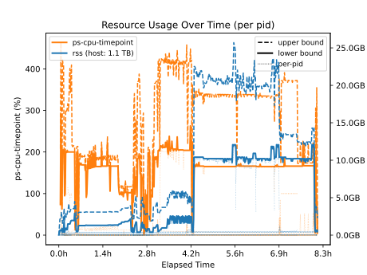</td></tr>
</table>

📋 Metadata

- **Info file**: [example_output_info.json](logs/fmriprep-ds002785-c5/acq-2026.09.08T19.49.36+64107796_1_info.json)
- **Usage data**: [example_output_usage.json](logs/fmriprep-ds002785-c5/acq-2026.09.08T19.49.36+64107796_1_usage.jsonl)
- **Standard output**: [stdout](logs/fmriprep-ds002785-c5/acq-2026.09.08T19.49.36+64107796_1_stdout)
- **Standard error**: [stderr](logs/fmriprep-ds002785-c5/acq-2026.09.08T19.49.36+64107796_1_stderr)

---

## 🛠️ Maintenance

This gallery is automatically updated daily via GitHub Actions.

- **Add an example**: Edit `con-duct-gallery.yaml` and create a pull request
- **Update plots**: Plots regenerate automatically when logs change
- **Force update**: Re-run the workflow with `workflow_dispatch`
