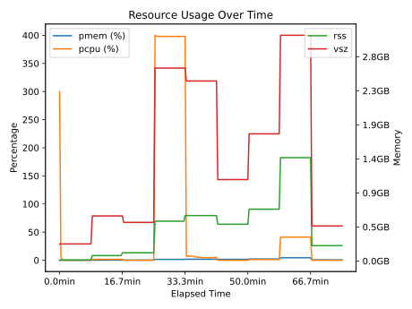

# con/duct Examples Gallery

> 🤖 Automatically generated gallery of con/duct usage examples
> Last updated: 2025-10-04 01:47 UTC

## 📚 Browse by Tag

**medium-length**: [con/duct Demo Example](#con-duct-demo-example)
**synthetic**: [con/duct Demo Example](#con-duct-demo-example)

## 📊 Examples

### con/duct Demo Example

**Tags**: `synthetic` `medium-length`
**Repository**: [github.com/con/duct](https://github.com/con/duct/)

Demo example from the con/duct repository showing resource usage tracking

📋 Metadata

- **Info file**: [example_output_info.json](logs/con-duct-demo-example/example_output_info.json)
- **Usage data**: [example_output_usage.json](logs/con-duct-demo-example/example_output_usage.json)
- **Standard output**: [stdout](logs/con-duct-demo-example/example_output_stdout)
- **Standard error**: [stderr](logs/con-duct-demo-example/example_output_stderr)

---

## 🛠️ Maintenance

This gallery is automatically updated daily via GitHub Actions.

- **Add an example**: Edit `con-duct-gallery.yaml` and create a pull request
- **Update plots**: Plots regenerate automatically when logs change
- **Force update**: Re-run the workflow with `workflow_dispatch`
