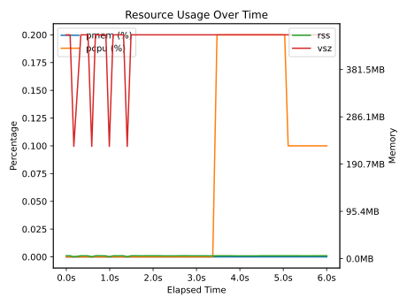
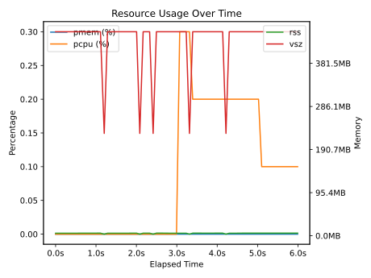
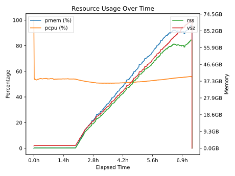
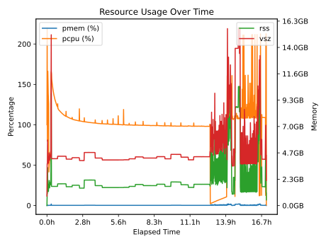

# con/duct Examples Gallery

> 🤖 Automatically generated gallery of con/duct usage examples
> Last updated: 2025-12-19 02:09 UTC

## 📚 Browse by Tag

#### asmacdo

[asmacdo-gallery example-1](#asmacdo-gallery-example-1), [asmacdo-gallery example-2](#asmacdo-gallery-example-2)

#### juelich

[mriqc processing on a single subject/session](#mriqc-processing-on-a-single-subject-session)

#### local

['s5cmd sync' dry invocation on a mighty dandiarchive bucket](#s5cmd-sync-dry-invocation-on-a-mighty-dandiarchive-bucket)

#### medium-length

[con/duct Demo Example](#con-duct-demo-example)

#### mriqc

[mriqc processing on a single subject/session](#mriqc-processing-on-a-single-subject-session)

#### s5cmd

['s5cmd sync' dry invocation on a mighty dandiarchive bucket](#s5cmd-sync-dry-invocation-on-a-mighty-dandiarchive-bucket)

#### synthetic

[con/duct Demo Example](#con-duct-demo-example), [asmacdo-gallery example-1](#asmacdo-gallery-example-1), [asmacdo-gallery example-2](#asmacdo-gallery-example-2)

## 📊 Examples

### con/duct Demo Example

**Tags**: [`synthetic`](#synthetic) [`medium-length`](#medium-length)
**Repository**: [github.com/con/duct](https://github.com/con/duct/)

Demo example from the con/duct repository showing resource usage tracking

📋 Metadata

- **Info file**: [example_output_info.json](logs/conduct-demo-example/example_output_info.json)
- **Usage data**: [example_output_usage.json](logs/conduct-demo-example/example_output_usage.json)
- **Standard output**: [stdout](logs/conduct-demo-example/example_output_stdout)
- **Standard error**: [stderr](logs/conduct-demo-example/example_output_stderr)

---

### asmacdo-gallery example-1

**Tags**: [`synthetic`](#synthetic) [`asmacdo`](#asmacdo)
**Repository**: [github.com/asmacdo/asmacdo-duct-gallery](https://github.com/asmacdo/asmacdo-duct-gallery/)

📋 Metadata

- **Info file**: [example_output_info.json](logs/asmacdo-gallery-example-1/example_output_info.json)
- **Usage data**: [example_output_usage.json](logs/asmacdo-gallery-example-1/example_output_usage.json)
- **Standard output**: [stdout](logs/asmacdo-gallery-example-1/example_output_stdout)
- **Standard error**: [stderr](logs/asmacdo-gallery-example-1/example_output_stderr)

---

### asmacdo-gallery example-2

**Tags**: [`synthetic`](#synthetic) [`asmacdo`](#asmacdo)
**Repository**: [github.com/asmacdo/asmacdo-duct-gallery](https://github.com/asmacdo/asmacdo-duct-gallery/)

📋 Metadata

- **Info file**: [example_output_info.json](logs/asmacdo-gallery-example-2/example_output_info.json)
- **Usage data**: [example_output_usage.json](logs/asmacdo-gallery-example-2/example_output_usage.json)
- **Standard output**: [stdout](logs/asmacdo-gallery-example-2/example_output_stdout)
- **Standard error**: [stderr](logs/asmacdo-gallery-example-2/example_output_stderr)

---

### 's5cmd sync' dry invocation on a mighty dandiarchive bucket

**Tags**: [`local`](#local) [`s5cmd`](#s5cmd)

📋 Metadata

- **Info file**: [example_output_info.json](/home/runner/work/duct-gallery/duct-gallery/logs/s5cmd-1/2024.10.28T11.08.51-2733714_info.json)
- **Usage data**: [example_output_usage.json](/home/runner/work/duct-gallery/duct-gallery/logs/s5cmd-1/2024.10.28T11.08.51-2733714_usage.json)
- **Standard output**: [stdout](/home/runner/work/duct-gallery/duct-gallery/logs/s5cmd-1/2024.10.28T11.08.51-2733714_stdout)
- **Standard error**: [stderr](/home/runner/work/duct-gallery/duct-gallery/logs/s5cmd-1/2024.10.28T11.08.51-2733714_stderr)

---

### mriqc processing on a single subject/session

**Tags**: [`mriqc`](#mriqc) [`juelich`](#juelich)
**Repository**: [cerebra.fz-juelich.de/f.hoffstaedter/ds005256-mriqc](https://cerebra.fz-juelich.de/f.hoffstaedter/ds005256-mriqc)

📋 Metadata

- **Info file**: [example_output_info.json](logs/mriqc-processing-on-a-single-subjectsession/example_output_info.json)
- **Usage data**: [example_output_usage.json](logs/mriqc-processing-on-a-single-subjectsession/example_output_usage.json)
- **Standard output**: [stdout](logs/mriqc-processing-on-a-single-subjectsession/example_output_stdout)
- **Standard error**: [stderr](logs/mriqc-processing-on-a-single-subjectsession/example_output_stderr)

---

## 🛠️ Maintenance

This gallery is automatically updated daily via GitHub Actions.

- **Add an example**: Edit `con-duct-gallery.yaml` and create a pull request
- **Update plots**: Plots regenerate automatically when logs change
- **Force update**: Re-run the workflow with `workflow_dispatch`
